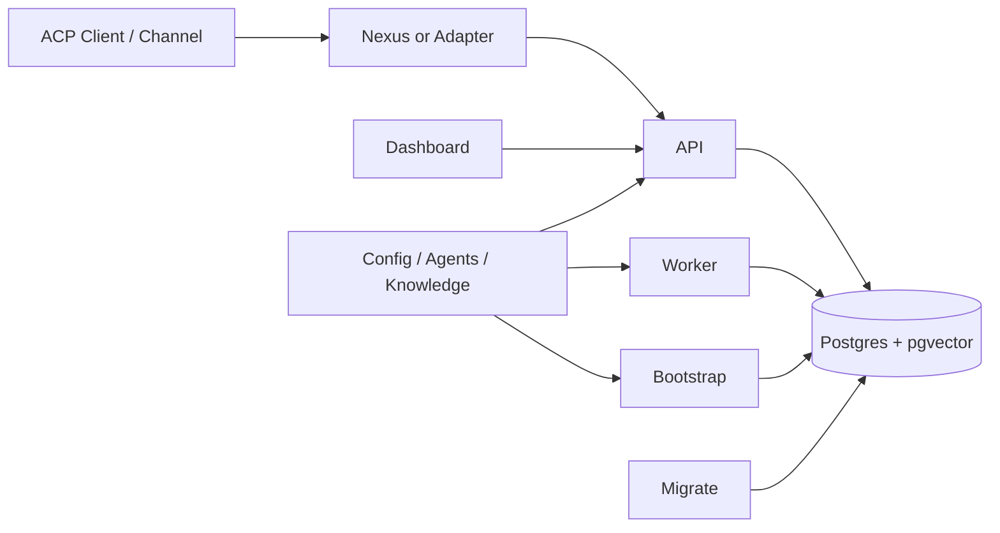
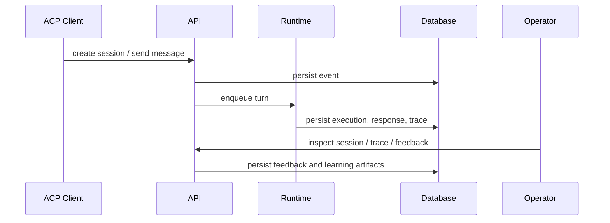

# Architecture

This document describes the current repository architecture, not just the long
range design target.

## System Shape

Parmesan is currently a modular Go monolith with multiple deployables:

- `api`
- `worker`
- `migrate`
- `bootstrap`
- `dashboard` frontend

Supporting infrastructure:

- PostgreSQL with pgvector
- optional Nexus as an ACP-facing channel layer

## Main Runtime Surfaces

### API

The API exposes:

- ACP conversation endpoints
- operator endpoints
- policy/control endpoints
- trace and execution inspection endpoints
- SSE streams for sessions and notifications

### Worker

The worker handles asynchronous work such as:

- knowledge compilation and sync
- maintainer and learning jobs
- media enrichment
- background evaluation and replay support

### Bootstrap

Bootstrap loads file-backed startup data:

- agent definitions
- policy bundle references
- seeded knowledge sources
- configured MCP providers

### Dashboard

The dashboard is the operator surface for:

- session inbox
- session intervention
- trace inspection
- notifications
- control-state inspection
- agent testing

## High-Level Flow

1. A client creates an ACP session.
2. The session gets normalized customer context.
3. A customer message enters ACP.
4. Parmesan creates or coalesces a durable execution.
5. The runtime resolves policy, retrieval, tools, and response composition.
6. Events, audit records, response records, and trace spans are persisted.
7. Operators can inspect the session, execution, and trace.
8. Feedback can produce customer preferences, knowledge proposals, and draft
   policy changes.

## Storage Model

Postgres is the primary system of record for:

- sessions
- events
- executions and execution steps
- responses and trace spans
- approvals
- tool runs
- delivery attempts
- audit records
- policy / rollout state
- knowledge sources / snapshots / proposals
- customer preferences
- maintainer jobs and workspaces

## Current Deployable Topology

Default compose startup:

- `postgres`
- `migrate`
- `bootstrap`
- `api`
- `worker`
- `dashboard`

The backend image now contains the stock file-backed deployment bundle:

- `/config`
- `/agents`
- `/knowledge`
- `/examples`

## Detailed Design Reference

For the longer-range system design and rationale, see:

- [Detailed Architecture Plan](../customer-facing-agent-architecture.md)

## Implementation References

- application wiring: `internal/app/app.go`
- HTTP API server: `internal/api/http/server.go`
- operator notification API: `internal/api/http/operator_dashboard.go`
- worker entrypoint: `internal/worker/server.go`
- store interfaces: `internal/store/interfaces.go`
- Postgres repository: `internal/store/postgres/repository.go`
- memory store: `internal/store/memory/store.go`
