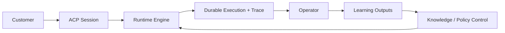

# Concepts

Parmesan is a customer-facing agent runtime with explicit policy control,
durable execution, supervised operations, and closed-loop learning.

## At A Glance

Use this page to build the correct mental model before diving into the lower
level docs.

Parmesan is designed for:

- customer-facing conversations, not open-ended autonomous exploration
- durable and inspectable execution, not ephemeral best-effort runs
- explicit policy boundaries, not hidden prompt-only behavior
- operator supervision and learning, not silent self-modification

## Core Mental Model

Parmesan is not an open-ended autonomous agent shell.

It is a supervised customer-facing system where:

- customers talk to agents through ACP
- agents run under explicit policy and tool constraints
- executions are durable and traceable
- operators can inspect, intervene, and teach
- learning updates customer memory, knowledge, and draft policy through
  controlled paths

## Main Building Blocks

| Building block | What it represents |
| --- | --- |
| agent profile | the durable identity and default operating scope of an agent |
| session | the durable conversation container |
| execution | one durable processing unit for a turn |
| trace | the causal record of what happened during that execution |
| policy bundle | the behavioral control layer |
| knowledge | the governed retrieval substrate |
| customer context | normalized and optionally enriched customer metadata |

### Agent Profile

An agent profile binds:

- an `agent_id`
- a default policy bundle
- a default knowledge scope
- metadata and capability boundaries

### Session

A session is the durable conversation container. It carries:

- `agent_id`
- `customer_id`
- channel
- events
- execution lineage
- session metadata and normalized customer context

### Execution

An execution is the durable processing unit for a turn. It has:

- an execution id
- a trace id
- execution steps
- status and retry state

### Trace

A trace is the causal sequence for one execution path. It connects:

- session events
- audit records
- execution records
- response records
- trace spans
- tool runs
- approvals
- delivery attempts

### Policy Bundle

Policies are authored in YAML and compiled into typed runtime records. They
define:

- guidelines
- journeys
- templates
- capability exposure
- style / SOUL guidance
- capability isolation

### Knowledge

Knowledge is file-seeded and compiled into a typed workspace. Runtime retrieval
uses immutable compiled knowledge snapshots; live turns do not mutate them.

### Customer Context

Customer identity and metadata are normalized from ACP `_meta` and can be
enriched from HTTP, SQL, or static sources. Only configured prompt-safe fields
are injected into the runtime prompt.

## One Useful Distinction

It helps to keep these concepts separate:

- `session`: the conversation container
- `execution`: one processing attempt for a turn
- `trace`: the detailed causal record connected to that execution
- `feedback`: operator or response-level input about what should improve later
- `learning`: governed downstream updates produced from feedback or conversation history

## Three Operational Planes

These planes interact, but they are intentionally not collapsed into one
undifferentiated agent loop.

### Runtime Plane

Handles live customer turns:

- event ingestion
- execution creation/coalescing
- policy resolution
- retrieval
- tool planning and invocation
- response generation

### Control Plane

Handles governed state:

- policy snapshots
- rollouts
- capability isolation
- knowledge state
- control changes

### Learning Plane

Handles post-conversation improvement:

- feedback compilation
- preference learning
- knowledge proposals
- draft policy updates
- regression/eval artifacts

## Practical Reading Path

After this page:

- read [Execution Model](./execution-model.md) for the difference between
  session, turn execution, worker, and async writes
- read [Architecture](./architecture.md) for deployables and data flow
- read [Engine](./engine.md) for turn execution
- read [Policies](./policies.md) for behavioral control
- read [Feedback Loop / Learning](./feedback-learning.md) for post-turn improvement

## Implementation References

- ACP session and event types: `internal/acp/types.go`
- ACP service layer: `internal/acp/service.go`
- session service: `internal/sessionsvc/service.go`
- runtime policy engine: `internal/runtime/policy/runtime.go`
- execution runner: `internal/runtime/runner/runner.go`
- customer context enrichment: `internal/customercontext/enricher.go`
- operator and ACP HTTP surfaces: `internal/api/http/server.go`
