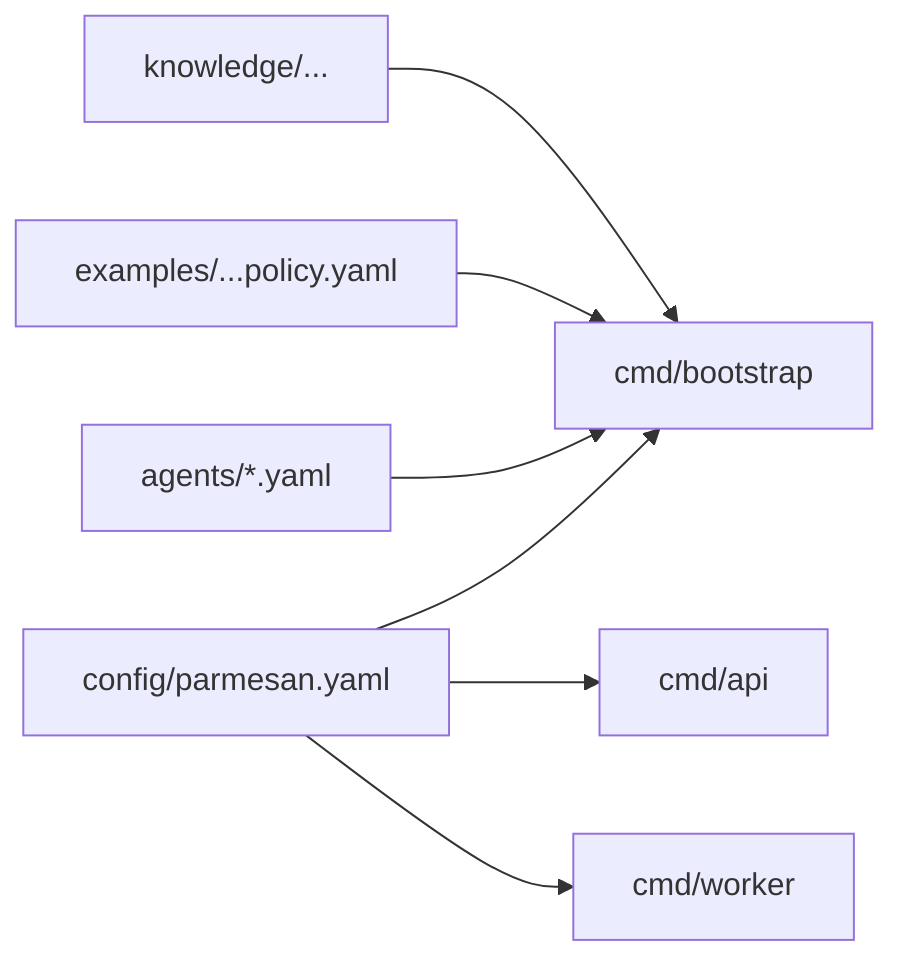

# Configuration

This document is the practical configuration reference for the current
repository.

Use it together with:

- [Getting Started](./getting-started.md) for boot flow
- [Policies](./policies.md) for policy authoring
- [Architecture](./architecture.md) for runtime shape

## At A Glance

Parmesan configuration is split across three file layers:

| Layer | Purpose | Typical path |
| --- | --- | --- |
| global runtime config | provider, database, MCP, ACP peer, operator, enrichment settings | `config/parmesan.yaml` |
| agent definition | one durable agent profile | `agents/*.yaml` |
| policy bundle | behavioral rules, templates, journeys, capability exposure | referenced from the agent file |

## Configuration Layers

Parmesan is configured from three main file layers:

1. Global runtime config in `config/parmesan.yaml`
2. Agent definition files in `agents/*.yaml`
3. Policy bundle files referenced by each agent definition

At startup:

1. `cmd/bootstrap` reads agent definition files from `bootstrap.agents_dir`
2. each agent file points at a policy bundle and optional knowledge seed path
3. `cmd/api` and `cmd/worker` load the same global runtime config



## Global Runtime Config

The runtime config file path is controlled by `PARMESAN_CONFIG`.

Current stock example:

- `config/parmesan.example.yaml`

Current stock deployment file:

- `config/parmesan.yaml`

### Mental Model

Use the global runtime config for infrastructure and catalogs, not for business
behavior.

- put provider, database, operator, MCP, ACP peer, and enrichment settings here
- put agent identity and default knowledge scope in the agent file
- put decision logic, templates, journeys, and capability exposure in the policy bundle

### Minimal Example

```yaml
http:
  address: ":8080"

database:
  url: "${DATABASE_URL}"

secrets:
  master_key: "${SECRETS_MASTER_KEY}"

providers:
  openrouter_api_key: "${OPENROUTER_API_KEY}"
  openai_base_url: "${OPENAI_BASE_URL}"
  default_reasoning: openrouter
  default_structured: openrouter
  default_embedding: openrouter

tool_providers:
  allowed_hosts: []
  allow_local_dev: false

operator:
  api_key: "${OPERATOR_API_KEY}"

knowledge:
  root: /knowledge

bootstrap:
  agents_dir: /agents
```

### Main Sections

| Section | What it controls |
| --- | --- |
| `http` | API bind address |
| `database` | Postgres connection |
| `secrets` | master encryption key |
| `providers` | model and embedding provider routing |
| `operator` | operator auth and identity defaults |
| `tool_providers` | outbound security policy for registered tool providers |
| `knowledge` | seeded knowledge root |
| `bootstrap` | where agent files are loaded from |
| `acp` | inbound coalescing and delegated-agent timeout |
| `mcp.providers` | globally registered MCP catalog |
| `agent_servers` | external ACP peer agents available for delegation |
| `customer_context.enrichment` | session-creation enrichment hook |
| `moderation.alerts` | operator moderation notification rules |
| `observability` | metrics and telemetry |
| `runtime` | request, async queue, and fallback retry-model settings |

`http`
- `address`: bind address for the API process. The file value can be overridden
  by `HTTP_ADDR`.

`database`
- `url`: Postgres connection string. The runtime requires a real database for
  the normal deployment path.

`secrets`
- `master_key`: symmetric key for encrypted secrets storage.

`providers`
- `openai_api_key`
- `openai_base_url`
- `openrouter_api_key`
- `openrouter_base_url`
- `default_reasoning`
- `default_structured`
- `default_embedding`
- `maintainer_reasoning`
- `maintainer_structured`
- `maintainer_embedding`

These select which registered provider family is used for customer execution
and maintainer/learning work. The stock config uses OpenRouter for all three
roles.

`tool_providers`
- `allowed_hosts`
- `allow_local_dev`

These control which remote hosts Parmesan is allowed to contact for registered
tool providers. In production, use an explicit host allowlist and HTTPS. For
local development against localhost MCP or OpenAPI servers, set
`allow_local_dev: true`.

`operator`
- `api_key`
- `trusted_id_header`
- `trusted_roles_header`
- `default_operator_id`
- `default_operator_roles`

`knowledge`
- `root`: filesystem root used when bootstrap resolves folder-backed knowledge
  seeds.

`bootstrap`
- `agents_dir`: directory scanned by `cmd/bootstrap` for `*.yaml` and `*.yml`
  agent definition files.

`acp`
- `response_coalesce_ms`: durable coalescing window for inbound customer
  messages before response execution starts
- `delegation_timeout_seconds`: max wait for delegated ACP peer agents

`mcp.providers`
- list of MCP provider registrations that bootstrap should materialize into the
  provider catalog

`agent_servers`
- local ACP peer agents started over stdio and exposed for delegation by policy

`customer_context.enrichment`
- optional server-side enrichment pipeline for session creation

`moderation.alerts`
- notification policy for operator-visible moderation alerts

`observability`
- metrics and OTLP settings

`runtime`
- execution concurrency, async write workers, async write queue, request timeout,
  and operator fallback retry-model profiles

Runtime fields:

- `execution_concurrency`: number of concurrent execution workers inside one
  `cmd/worker` process. Each worker handles one execution at a time, and LLM
  calls or tool calls block that worker until they complete.
- `async_write_workers`: number of background async-write workers used by the
  API, gateway, and worker processes.
- `async_write_queue_size`: buffered async-write queue depth.
- `request_timeout_seconds`: outbound request timeout used by runtime HTTP calls.

Defaults:

- `execution_concurrency`: `2`
- `async_write_workers`: `2`
- `async_write_queue_size`: `256`
- `request_timeout_seconds`: `15`

Sizing guidance:

- Parmesan is now concurrent across executions, but still blocking within a
  single execution. Slow LLM or tool calls occupy one execution worker.
- Start with `1.5-2` execution workers per vCPU for mixed workloads.
- For a `4 vCPU` node, a practical starting point is:
  - `execution_concurrency: 6`
  - `async_write_workers: 3`
- If the node is mostly waiting on LLM/tool I/O and Postgres is healthy, try
  `execution_concurrency: 8`.
- If Postgres latency, queue lag, or tail latency rises, move back toward `4`.

Recent local benchmark notes on a `4`-CPU test harness:

- throughput scaled strongly from `1 -> 2 -> 4` execution workers
- `6` workers improved throughput slightly over `4`
- `8` workers improved peak throughput a little more, but tail latency rose
  noticeably
- the practical knee of the curve was around `4-6` workers

### Runtime Retry Model Profiles

The runtime config can define curated fallback profiles that operators may use
when retrying a blocked or failed execution.

These profiles are read-only from the dashboard. Operators choose from the
configured list; they do not type arbitrary provider or model ids.

```yaml
runtime:
  execution_concurrency: 6
  async_write_workers: 3
  retry_model_profiles:
    - id: structured_safe
      name: Structured-safe fallback
      reasoning_provider: openrouter
      reasoning_model: openai/gpt-4.1-mini
      structured_provider: openrouter
      structured_model: openai/gpt-4.1
    - id: provider_swap
      name: Provider swap fallback
      reasoning_provider: openai
      reasoning_model: gpt-4.1-mini
      structured_provider: openai
      structured_model: gpt-4.1-mini
```

Fields:

- `id`: stable profile id used by the operator API
- `name`: operator-facing label shown in the dashboard
- `reasoning_provider`: optional provider override for customer-facing response generation
- `reasoning_model`: optional concrete model override for customer-facing response generation
- `structured_provider`: optional provider override for customer-facing structured policy calls
- `structured_model`: optional concrete model override for customer-facing structured policy calls

Behavior:

- the override is execution-scoped, not session-scoped
- it only applies to the retried execution
- it affects customer-facing `reasoning` and `structured` calls
- it does not affect embeddings, maintainer jobs, moderation, or delegated ACP peer agents

### Environment Override Rules

Parmesan loads file config first, then applies environment overrides.

Important runtime env vars:

- `PARMESAN_CONFIG`
- `DATABASE_URL`
- `SECRETS_MASTER_KEY`
- `OPENAI_API_KEY`
- `OPENAI_BASE_URL`
- `OPENROUTER_API_KEY`
- `OPENROUTER_BASE_URL`
- `DEFAULT_REASONING_PROVIDER`
- `DEFAULT_STRUCTURED_PROVIDER`
- `DEFAULT_EMBEDDING_PROVIDER`
- `DEFAULT_MAINTAINER_REASONING_PROVIDER`
- `DEFAULT_MAINTAINER_STRUCTURED_PROVIDER`
- `DEFAULT_MAINTAINER_EMBEDDING_PROVIDER`
- `OPERATOR_API_KEY`
- `OPERATOR_TRUSTED_ID_HEADER`
- `OPERATOR_TRUSTED_ROLES_HEADER`
- `DEFAULT_OPERATOR_ID`
- `DEFAULT_OPERATOR_ROLES`
- `KNOWLEDGE_SOURCE_ROOT`
- `PARMESAN_AGENTS_DIR`
- `ACP_RESPONSE_COALESCE_MS`
- `ACP_DELEGATION_TIMEOUT_SECONDS`

The config loader also supports `${VAR}` interpolation inside YAML file values.

## Agent Definition Files

Each file in `agents/*.yaml` defines one bootstrapped agent profile.

Current stock example:

- `agents/live_support.yaml`

### What Belongs Here

An agent definition should answer:

- what this agent is called
- which policy bundle controls it
- which seeded knowledge should be attached initially
- what the default knowledge scope is
- what profile metadata operators or runtime extensions should see

### Example

```yaml
id: agent_profile_live_support
name: Live Support Agent
description: Customer-facing support agent for orders, shipping, returns, refunds, and account help.
status: active
policy_bundle_path: ../examples/live_support_policy.yaml
knowledge_seed_path: live_support
knowledge_source_id: source_live_support_seed
default_knowledge_scope:
  kind: agent
  id: agent_profile_live_support
metadata:
  release_sample: true
  channel: acp
```

### Fields

`id`
- durable agent profile id

`name`
- operator-facing display name

`description`
- operator-facing description

`status`
- defaults to `active` when omitted

`policy_bundle_path`
- required path to the YAML policy bundle
- relative paths resolve relative to the agent definition file

`knowledge_seed_path`
- optional folder path under the configured knowledge root

`knowledge_source_id`
- optional durable id for the bootstrapped knowledge source

`default_knowledge_scope`
- defaults to `kind: agent` and the agent `id` if omitted

`capability_isolation`
- optional metadata block used to constrain visible tools or delegated agents

`metadata`
- arbitrary profile metadata
- currently also used for some runtime extensions such as
  `moderation_alerts`

## Policy Bundle Configuration

Policy bundles are authored as YAML and compiled during bootstrap.

A minimal useful bundle usually contains:

- `id`
- `version`
- `composition_mode`
- `no_match`
- `domain_boundary`
- `soul`
- `guidelines`
- `templates`

Use policy bundles for behavior, not infrastructure. If you are trying to set a
model provider, MCP registration, or ACP peer process command here, it belongs
in the global config instead.

See:

- `examples/live_support_policy.yaml`
- [Policies](./policies.md)

## Connections And Integrations

This section covers the parts that usually need concrete examples in a real
deployment.

### Model Provider Connection

The stock path uses OpenRouter:

```yaml
providers:
  openai_base_url: "${OPENAI_BASE_URL}"
  openrouter_api_key: "${OPENROUTER_API_KEY}"
  openrouter_base_url: "${OPENROUTER_BASE_URL}"
  default_reasoning: openrouter
  default_structured: openrouter
  default_embedding: openrouter
```

This controls both runtime generation and embedding selection. Maintainer work
can use separate provider routing via the `maintainer_*` fields.

Practical rule:

- `default_*` controls customer-facing runtime work
- `maintainer_*` controls learning, wiki maintenance, and policy-drafting work

### Local OpenAI-Compatible Backends

Parmesan does not have a separate built-in `ollama`, `lmstudio`, or
`llama.cpp` model provider. Instead, you can point the existing OpenAI-shaped
provider slot at any OpenAI-compatible local server.

At minimum, this works for:

- LM Studio
- Ollama
- llama.cpp `llama-server`

Parmesan-side example:

```yaml
providers:
  openai_api_key: "local-dev"
  openai_base_url: "http://127.0.0.1:1234/v1"
  default_reasoning: openai
  default_structured: openai
  default_embedding: openai

tool_providers:
  allow_local_dev: true
```

Backend-side examples:

LM Studio:

```bash
lms server start --port 1234
```

Ollama:

```bash
ollama serve
```

Then expose Parmesan to:

```text
http://127.0.0.1:11434/v1
```

llama.cpp:

```bash
llama-server -m /models/model.gguf --port 8080
```

Then expose Parmesan to:

```text
http://127.0.0.1:8080/v1
```

Recommended local routing targets:

- LM Studio: `http://127.0.0.1:1234/v1`
- Ollama: `http://127.0.0.1:11434/v1`
- llama.cpp: `http://127.0.0.1:8080/v1`

### MCP Providers

MCP providers are configured globally, then registered during bootstrap.

Example:

```yaml
mcp:
  providers:
    - id: docs
      name: Docs MCP
      kind: mcp
      base_url: http://docs-mcp:8080
```

This registers the provider in the tool catalog. Policy still needs to expose
the relevant capability before the runtime can use it.

That split is deliberate:

- config says what exists
- policy says what the agent may use

### Delegated ACP Peer Agents

ACP peer agents are configured under `agent_servers`.

Example:

```yaml
agent_servers:
  OpenCode:
    command: opencode
    args: ["acp", "--pure"]
    startup_timeout_seconds: 10
    request_timeout_seconds: 30
    acp:
      model: anthropic/claude-3.7-sonnet
      prompt_prefix: "You are the implementation worker for the parent agent."
      prompt_suffix: "Return only the final answer for the parent agent."
      mcp_servers:
        - type: stdio
          name: Repo Tools
          command: npx
          args: ["-y", "@acme/repo-mcp"]
          env:
            REPO_TOKEN: "${REPO_TOKEN}"
        - type: sse
          name: Docs
          url: "https://docs.example/sse"
          headers:
            Authorization: "Bearer ${DOCS_TOKEN}"
```

This section defines how Parmesan starts or connects to the peer agent process.
The policy bundle only refers to the peer by id.

These peers are available for policy-driven delegation. They are not implicitly
used by the runtime. Policy must expose them.

The nested `acp` block controls how Parmesan opens the delegated ACP session:

- `model`: sent through ACP `session/set_config_option` when the peer agent
  advertises a compatible model config option; otherwise Parmesan skips the
  override and continues delegation
- `mcp_servers`: sent through ACP `session/new`
- `prompt_prefix` and `prompt_suffix`: wrapped around Parmesan's generated
  delegated prompt before `session/prompt`

These are invocation defaults for that external agent server. They do not
change Parmesan's own runtime model routing or public ACP session contract.
When an ACP peer omits `mcpCapabilities` during `initialize`, Parmesan treats
that as unknown capability metadata and still attempts `session/new` with the
configured MCP servers.

Operationally, think of this as a delegation profile for that peer server:

- which model Parmesan should try to request
- which MCP servers Parmesan should attach for that delegated session
- what framing text Parmesan should wrap around the delegated task

### Customer Context Enrichment

Session creation can enrich `customer_context` before the session is persisted.

Practical boundary:

- ACP `_meta` carries caller-supplied context
- enrichment augments it from trusted server-side sources
- only configured prompt-safe fields are later injected into runtime prompts

Supported source types:

- `static`
- `http`
- `sql`

Example:

```yaml
customer_context:
  enrichment:
    enabled: true
    timeout_seconds: 2
    on_error: continue
    sources:
      - id: crm
        type: http
        merge_strategy: overwrite
        prompt_safe_fields: [name, tier]
        request:
          method: POST
          url: https://crm.internal/customers/lookup
          headers:
            Authorization: "Bearer ${CRM_TOKEN}"
          body_template: |
            {"customer_id":"{{ customer.id }}"}
```

Supported merge behaviors:

- `ignore`
- `overwrite`
- `keep_both`

Per-field merge overrides can be set with `field_merge`.

### Moderation Alerts

Global moderation alerts:

```yaml
moderation:
  classifier:
    enabled: true
  alerts:
    enabled: true
    notify_on_censored: true
    notify_on_jailbreak: true
    notify_categories:
      - self_harm
      - violence
```

Per-agent override:

```yaml
metadata:
  moderation_alerts:
    enabled: false
```

Use agent-level overrides only when one profile genuinely needs a different
alert posture than the global default.

### Moderation Classifier

Moderation now runs as a layered pipeline:

1. input normalization
2. local category rules
3. optional structured-model classifier
4. final decision resolution

The public moderation result is still backward compatible:

- `decision` remains `allowed` or `censored`
- `provider` reflects the decisive stage:
  - `local` when local rules already decide the outcome
  - `llm` when the classifier becomes the decisive stage

Enable the classifier with:

```yaml
moderation:
  classifier:
    enabled: true
```

Environment override:

- `MODERATION_LLM_ENABLED=true|false`

Mode behavior stays explicit:

- `off`: bypass moderation
- `local`: normalization plus local rules only
- `auto`: local rules first, then classifier if enabled
- `paranoid`: same pipeline, but stricter censor behavior for categories such as
  `self_harm`, `violence`, `illicit`, and `prompt_injection`

Local rules are now organized by category instead of a single flat pattern
list. Current built-in categories include:

- `abuse`
- `sexual`
- `self_harm`
- `violence`
- `illicit`
- `prompt_injection`
- `jailbreak`

## Practical Setup Patterns

### One Agent, One Policy Bundle, Seeded Knowledge

- define one file in `agents/`
- point it at one bundle in `examples/` or another policy directory
- seed one knowledge folder under `knowledge/`
- run `cmd/bootstrap`

### Multiple Agents In One Runtime

- place multiple YAML agent files in `agents/`
- give each one its own `id`
- use a distinct policy bundle path for each
- set `default_knowledge_scope` explicitly when scopes should not equal agent id
- serve ACP traffic through agent-scoped routes such as
  `POST /v1/acp/agents/{agent_id}/sessions`

### Operator Dashboard

The dashboard expects:

- API reachable at `/v1`
- operator authentication via `OPERATOR_API_KEY` or trusted headers

The Vite dev server uses `PARMESAN_API_URL` for backend proxying.

## Implementation References

- global config model and env overrides: `internal/config/config.go`
- bootstrap agent file loading: `cmd/bootstrap/main.go`
- stock runtime config: `config/parmesan.example.yaml`
- stock agent definition: `agents/live_support.yaml`
- stock policy bundle: `examples/live_support_policy.yaml`
- moderation override lookup: `internal/api/http/server.go`
