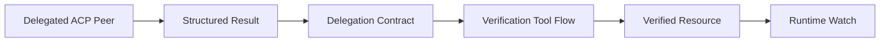

# Delegation Contracts

This page describes the generic `delegation_contracts` feature in Parmesan.

Use it when you need to:

- verify delegated agent results against real external systems
- create watches from delegated resources only after confirmation
- understand the difference between generic engine behavior and an
  integration-specific contract instance

## What A Delegation Contract Is

A delegation contract is a policy-defined bridge between:

- a delegated ACP peer agent result
- a verified external resource
- an optional runtime watch

The important point is that the engine does not need to know domain-specific
resource semantics such as “ticket”, “case”, or “order” in core runtime code.
Instead, the contract tells the engine:

- which delegated agents the contract applies to
- which result fields must be present
- how to verify the returned resource
- how to map verified fields into a canonical resource shape
- which watch capability to create after verification
- what failure message to use if verification does not succeed

## Why This Exists

Without a contract, delegated output is just delegated output. A peer agent may
say it created something, but the runtime has no durable proof that the
resource exists.

Delegation contracts add a post-delegation confirmation step:

1. the delegated agent returns structured result data
2. Parmesan matches the result to a contract
3. Parmesan runs the configured verification tool flow
4. Parmesan builds a canonical verified resource
5. Parmesan optionally creates a watch from that verified resource

This keeps the engine generic while still allowing integrations to become
durable and resumable after delegation.

## High-Level Flow



## Contract Shape

A contract is declared inside a policy bundle under `delegation_contracts`.

At a high level, a contract defines:

- `id`
- `agent_ids`
- `resource_type`
- `result_text_field`
- `required_result_fields`
- `field_aliases`
- `verification`
- `watch_capability_id`
- `failure_user_message`

The engine uses that information to turn a delegated result into a verified
runtime resource.

## Canonical Resource Model

After verification, the runtime normalizes the delegated result into a generic
resource shape:

```yaml
resource:
  type: support_ticket
  id: external-system-record-id
  display_id: human-readable-reference
  status: resolved
  attributes:
    any_extra_field: value
```

This is intentionally generic. The engine works with `resource.id`,
`resource.display_id`, `resource.status`, and `resource.attributes` rather than
domain-specific names.

## Verification Model

The verification block tells Parmesan how to confirm the delegated resource.

Typical elements are:

- `primary_tool_id`
- `primary_args`
- `fallback_tools`
- `extract_paths`
- `require_match_on`

The engine will:

1. run the primary verification tool
2. optionally try fallback tools if the primary path does not confirm the
   resource
3. extract canonical resource fields from the verification output
4. require the configured fields to match before treating the resource as
   verified

If verification fails, the runtime does not create the watch and uses the
configured failure message instead.

## Example

```yaml
delegation_contracts:
  - id: complaint_ticket
    agent_ids:
      - OpenCodeOrbyteMinimal
    resource_type: support_ticket
    result_text_field: user_message
    required_result_fields:
      - ticket_id
      - ticket_number
      - status
    field_aliases:
      - target: resource.id
        sources: [ticket_id]
      - target: resource.display_id
        sources: [ticket_number]
      - target: resource.status
        sources: [status]
    verification:
      primary_tool_id: orbyte_minimal.crm.ticket.get
      primary_args:
        ticket_id: "{{resource.id}}"
      fallback_tools:
        - tool_id: orbyte_minimal.crm.ticket.search
          args:
            query: "{{resource.display_id}}"
      extract_paths:
        resource.id:
          - structuredContent.id
        resource.display_id:
          - structuredContent.values.ticket_number
        resource.status:
          - structuredContent.values.status
      require_match_on:
        - resource.id
        - resource.display_id
    watch_capability_id: orbyte_minimal.crm.ticket.get
    failure_user_message: I could not confirm ticket creation yet.
```

This example is integration-specific, but the mechanism is generic.

## Watch Creation

Delegation contracts can bind to a watch capability with `watch_capability_id`.

That means:

- the delegated peer can create a resource
- Parmesan verifies the resource
- then Parmesan creates a runtime watch from the verified resource

This is how delegated complaint intake can become proactive status-follow-up
without hardcoding complaint-specific behavior into core runtime.

## Failure Behavior

If the delegated output does not satisfy the contract, Parmesan does not assume
success.

Typical outcomes:

- required fields are missing
- verification tool cannot confirm the resource
- verification output does not match the delegated reference

When that happens:

- the delegated result is treated as unverified
- no watch is created
- the contract failure message is used

This is a fail-closed design.

## Engine vs Integration

The contract system itself is core engine behavior.

What varies per integration is:

- which agent ids are bound
- which fields the delegated peer returns
- which verification tools are used
- which watch capability is created

So:

- generic engine logic lives under `internal/engine/`
- integration-specific contract instances live in policy bundles under
  `integrations/` or other bundle locations

## Related Documents

- [Policies](./policies.md)
- [Engine](./engine.md)
- [Architecture](./architecture.md)
