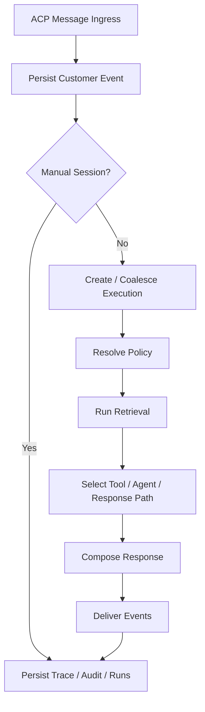
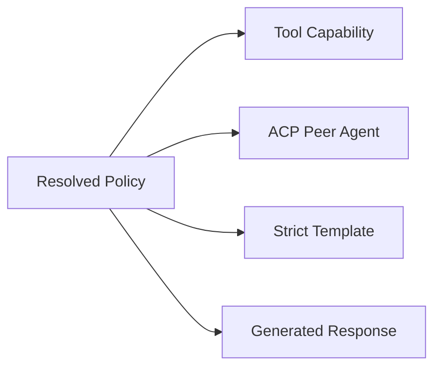

# Engine

This document describes how the live runtime engine behaves.

## What This Page Covers

Use this page when you need to understand:

- what happens after an ACP message arrives
- where executions and traces come from
- when policy, retrieval, tools, approvals, and delegated agents are involved
- what the runtime intentionally does not do

If you need the simpler mental model for `session` vs `turn execution` vs
`worker`, start with [Execution Model](./execution-model.md).

## Turn Lifecycle

The runtime is easier to understand if you read the turn in seven stages:

### 1. Ingress

ACP is the primary conversation edge. A customer message enters through:

- `POST /v1/acp/sessions/{id}/messages`
- or the agent-scoped ACP equivalent

If the session is in manual mode, the message is persisted but no automated
execution is started.

That distinction matters operationally: manual mode changes execution behavior
without losing the durable session history.

### 2. Execution Creation

Parmesan creates or coalesces a durable execution. Coalescing is controlled by
`acp.response_coalesce_ms`.

Every execution gets:

- execution id
- trace id
- persisted execution steps
- resumable status

Executions are durable first-class records, not transient internal objects.

### 3. Policy Resolution

The runtime resolves the effective policy for the turn:

- guidelines
- journeys
- templates
- capability isolation
- allowed tools
- allowed delegated agents
- retrieval scopes

This stage decides the behavioral envelope for the turn before generation or
tool use proceeds.

### 4. Retrieval

Retrieval is response-scoped grounding. It uses compiled knowledge snapshots and
does not directly mutate active policy or knowledge state.

Retrieval improves the turn. It is not itself a learning operation.

### 5. Tool / Agent Selection

The runtime may stage:

- tools
- approvals
- delegated ACP peer agents

Capability exposure is controlled by policy. Discovery is not exposure.

That means global catalogs can be large while each agent still operates inside
an explicit behavioral boundary.

### 6. Response Composition

Responses may be:

- strict template outputs
- generated outputs
- multiple ordered messages when the policy/template requires them

Templates, tool output, and generation are all part of the same response path,
but policy determines which one wins.

### 7. Delivery And Tracing

The engine persists:

- session events
- audit records
- response records
- response trace spans
- tool runs
- delivery attempts

This is what powers replay, debugging, and operator trace inspection.

If an operator needs to understand why a reply happened, these durable records
are the evidence trail.

## Durability Model

Executions are durable and operator-recoverable. Operators can:

- retry
- retry with a configured fallback model profile
- unblock
- abandon
- take over the session

This is a core design choice: runtime state is not treated as ephemeral best
effort state.

That design is what makes retries, operator recovery, and trace inspection
work reliably.

### Retryable Dependency Failures

Durability also applies to downstream dependency outages during a turn.

If a retryable MCP or tool call fails while a step is running:

- the error is written onto the durable execution step
- the execution can move into `waiting`
- the same execution id can resume later on a new attempt
- the runtime does not need to create a replacement turn to recover

This was validated against the live Orbyte + Nexus stack by stopping
`orbyte_full` during the product flow, observing retryable MCP failures in
`compose_response`, restarting Orbyte, and then watching the same execution
complete successfully on a later attempt.

This is different from graceful fail-soft behavior. Some delegated flows may
choose to degrade gracefully instead of leaving the execution in a retryable
blocked state. That is integration behavior layered on top of the same durable
engine.

## Runtime Constraints

The engine is intentionally constrained:

- policies are explicit
- customer preferences are not policy overrides
- retrieval is not learning
- runtime turns do not silently mutate active policy
- only prompt-safe customer fields enter the runtime prompt

These are product constraints, not implementation accidents.

## External Capability Model

Parmesan supports:

- MCP-backed tools
- external ACP peer agents

Peer agents compete as capabilities inside policy selection; they are not an
implicit orchestration layer outside policy.

Practical implication:

- a delegated ACP peer is one possible policy-selected capability
- it is not a hidden planner/executor layer running outside policy governance

## Delegation Contracts In The Engine

Delegation and verification are now separate runtime concerns.

The engine can:

1. delegate a turn to an ACP peer
2. receive structured delegated output
3. match that output to a policy-defined `delegation_contract`
4. verify the delegated resource through configured tools
5. create a watch only after verification succeeds

So a delegated peer is not automatically trusted just because it returned a
plausible answer. The engine can require confirmation before it treats the
result as a durable resource for follow-up behavior.

This is especially important for flows such as:

- complaint or support tickets
- orders or shipments
- approvals
- external jobs

Read [Delegation Contracts](./delegation-contracts.md) for the exact contract
model.

## Moderation Pipeline In The Engine

Moderation still exposes the same public runtime shape:

- `decision: allowed | censored`
- `provider`
- `reason`
- `categories`
- `jailbreak`

But the implementation is now layered instead of being one flat matcher.

The moderation pipeline is:

1. normalize the input
2. evaluate local category rules
3. optionally run the structured-model classifier
4. resolve the final decision

This keeps two things true at the same time:

- the public moderation contract stays stable
- the internal implementation can grow by category and stage instead of piling
  more ad hoc phrase checks into one function

The decisive provider is still explicit:

- `local` means local rules were sufficient
- `llm` means the classifier became the decisive stage

Mode behavior is still config-driven, not inferred from the model:

- `off`
- `local`
- `auto`
- `paranoid`

`paranoid` uses the same pipeline, but with a stricter censor posture for
unsafe categories such as self-harm, violence, illicit guidance, and prompt
injection.

## Extraction Surfaces

There are now three different kinds of extraction in the engine, and they
should not be confused with each other.

### 1. Learning Extraction

This is post-turn extraction that produces durable learning artifacts such as:

- `preferred_name`
- `contact_channel`

It feeds the learning system and customer preferences. It does not directly run
tools or verify delegated resources.

### 2. Tool-Argument Extraction

This is runtime argument inference used to help populate tool inputs from the
current turn context.

Examples:

- inferring a product name for a product lookup tool
- inferring a customer name for a CRM follow-up tool

This happens during planning/runtime execution and is adapter-aware through the
tool argument resolver boundary.

### 3. Delegation-Contract Extraction

This is post-delegation extraction that maps delegated result fields and
verification output into a canonical resource shape such as:

- `resource.id`
- `resource.display_id`
- `resource.status`

This drives delegated verification and watch creation, not general learning or
tool argument inference.

The distinction matters:

- learning extraction creates durable memory/proposals
- tool-argument extraction helps run tools
- delegation-contract extraction helps verify delegated resources

## Retrieval Outcomes And Grounding

The retriever stage now emits a typed retrieval outcome instead of relying on
raw result-count heuristics.

`RetrieverStageResult` includes:

- `results`
- `transient_guidelines`
- `knowledge_snapshot_id`
- `outcome`

The typed `outcome` carries:

- `attempted`
- `state`
- `has_usable_evidence`
- `grounding_required`

Current retrieval states are:

- `not_attempted`
- `evidence_available`
- `guidance_available`
- `insufficient`
- `no_results`

Why this matters:

- `evidence_available` means retrieval produced usable grounded material
- `guidance_available` means the retriever returned transient guidance that
  should count as successful retrieval even without citations or structured
  data payloads
- `insufficient` means retrieval ran but could not produce usable evidence
- `no_results` means retrieval ran and returned nothing usable

The renderer and prompt composer now consume this typed outcome instead of
checking only whether retrieved results exist.

Practical behavior:

- if grounded evidence exists, the engine stays on the grounded composition
  path
- if only transient retriever guidance exists, the engine can still follow that
  guidance without being forced into a grounded-miss path
- if retrieval completed but evidence was insufficient, the engine can compose
  an honest miss instead of silently falling back to generic guideline text

## Implementation References

- turn ingress and ACP message handling: `internal/api/http/server.go`
- execution creation and turn enqueueing: `internal/api/http/server.go`
- runner orchestration: `internal/engine/runner/runner.go`
- policy stages: `internal/engine/policy/`
- tool invocation: `internal/toolruntime/invoker.go`
- response rendering: `internal/engine/runner/render.go`
- moderation path: `internal/moderation/moderation.go`
