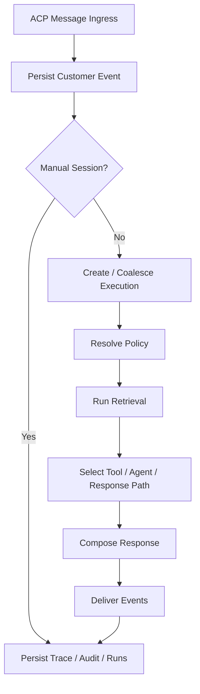
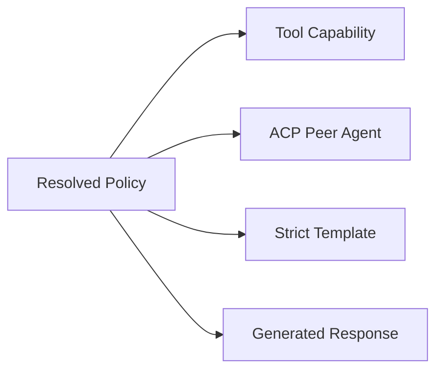

# Engine

This document describes how the live runtime engine behaves.

## Turn Lifecycle

### 1. Ingress

ACP is the primary conversation edge. A customer message enters through:

- `POST /v1/acp/sessions/{id}/messages`
- or the agent-scoped ACP equivalent

If the session is in manual mode, the message is persisted but no automated
execution is started.

### 2. Execution Creation

Parmesan creates or coalesces a durable execution. Coalescing is controlled by
`acp.response_coalesce_ms`.

Every execution gets:

- execution id
- trace id
- persisted execution steps
- resumable status

### 3. Policy Resolution

The runtime resolves the effective policy for the turn:

- guidelines
- journeys
- templates
- capability isolation
- allowed tools
- allowed delegated agents
- retrieval scopes

### 4. Retrieval

Retrieval is response-scoped grounding. It uses compiled knowledge snapshots and
does not directly mutate active policy or knowledge state.

### 5. Tool / Agent Selection

The runtime may stage:

- tools
- approvals
- delegated ACP peer agents

Capability exposure is controlled by policy. Discovery is not exposure.

### 6. Response Composition

Responses may be:

- strict template outputs
- generated outputs
- multiple ordered messages when the policy/template requires them

### 7. Delivery And Tracing

The engine persists:

- session events
- audit records
- response records
- response trace spans
- tool runs
- delivery attempts

This is what powers replay, debugging, and operator trace inspection.

## Durability Model

Executions are durable and operator-recoverable. Operators can:

- retry
- unblock
- abandon
- take over the session

This is a core design choice: runtime state is not treated as ephemeral best
effort state.

## Runtime Constraints

The engine is intentionally constrained:

- policies are explicit
- customer preferences are not policy overrides
- retrieval is not learning
- runtime turns do not silently mutate active policy
- only prompt-safe customer fields enter the runtime prompt

## External Capability Model

Parmesan supports:

- MCP-backed tools
- external ACP peer agents

Peer agents compete as capabilities inside policy selection; they are not an
implicit orchestration layer outside policy.

## Implementation References

- turn ingress and ACP message handling: `internal/api/http/server.go`
- execution creation and turn enqueueing: `internal/api/http/server.go`
- runner orchestration: `internal/runtime/runner/runner.go`
- policy stages: `internal/runtime/policy/`
- tool invocation: `internal/toolruntime/invoker.go`
- response rendering: `internal/runtime/runner/render.go`
- moderation path: `internal/moderation/moderation.go`
