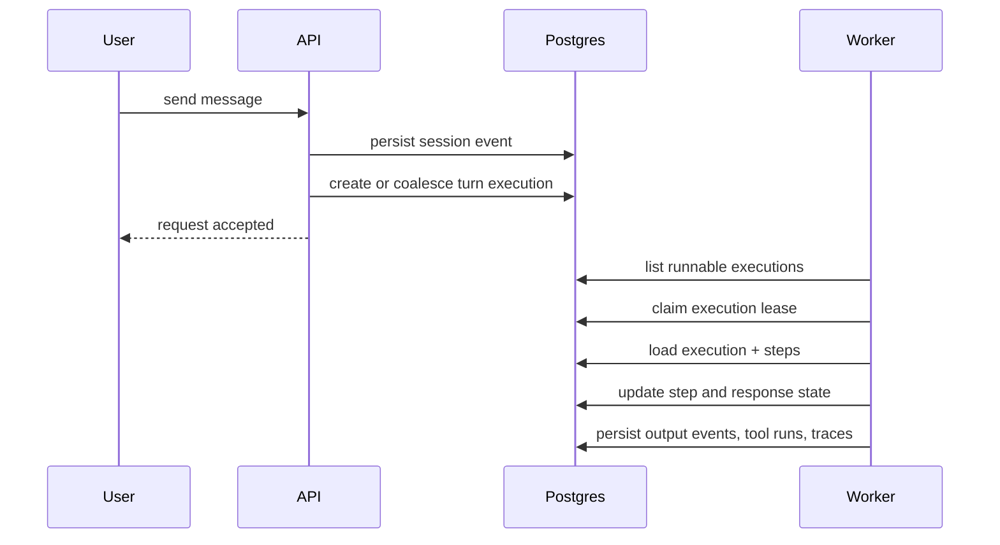

# Execution Model

This page explains the difference between `session`, `turn execution`,
`worker`, and `async writes`.

Use it when you understand the conversation model already, but want the correct
runtime and operations mental model.

## Short Version

- `session` = the conversation container
- `event` = one message or system event inside the session
- `turn execution` = one durable processing unit created for a customer turn
- `execution step` = one stage inside that turn execution
- `worker` = the background process that runs executions
- `async writes` = the background persistence queue used to flush many writes

So:

- `async execution` is the job model
- `worker` is the process that performs the job

They are related, but they are not the same thing.

## Session vs Turn

A `session` is the durable conversation.

Each time the customer sends a message, Parmesan persists that message as a
session event. That incoming event may create a new turn execution, or it may
be coalesced into an existing pending turn depending on the ACP coalescing
window.

Useful distinction:

- the `session` lives for the whole conversation
- the `turn execution` is one processing attempt for one customer turn

One session can therefore have many executions over time.

## What A Turn Execution Is

A turn execution is the durable record of the runtime trying to produce a
response after a customer message.

It is not just an in-memory function call. It is stored in Postgres together
with:

- execution id
- trace id
- status
- lease state
- retry/blocking state
- execution steps

That durability is what makes the runtime resumable and operator-recoverable.
If the process dies halfway through a turn, another worker can pick the turn up
from stored state rather than losing it.

## What Execution Steps Are

One turn execution usually contains multiple steps. In the current runtime that
often includes stages such as:

- ingest
- resolve policy
- match and plan
- compose response
- deliver response

Those steps are tracked individually with their own status and lease metadata.
That means a turn is not just “running or not running”; Parmesan knows which
part of the turn is in progress, blocked, waiting for retry, or finished.

## What The Worker Is

`cmd/worker` is a separate background process.

Its job is to look for runnable durable work and execute it. In the current
application wiring, the worker process starts:

- the runtime execution runner
- maintainer jobs
- lifecycle jobs
- replay jobs

So “worker” does not mean “one execution”. It means “the service process that
runs background work”.

One worker process can now run multiple executions concurrently.

The code that implements this now lives under the generic engine tree:

- policy resolution and matching: `internal/engine/policy/`
- execution runner and delegated capability handling: `internal/engine/runner/`
- semantic helpers used by planning and stage evaluation: `internal/engine/semantics/`

That split is intentional. The worker process is a deployable shell around the
engine, not the engine itself.

## What “Async Execution” Means Here

When a customer message arrives, the API does not try to do all response work
inline inside the HTTP request.

Instead, the usual pattern is:

1. persist the inbound event
2. create or coalesce a durable turn execution
3. return control to the caller
4. let a background worker pick up the execution
5. run the execution steps
6. persist the response and follow-up records

That is what “async execution” means in Parmesan:

- the turn is modeled as durable background work
- a separate worker process executes it later

The turn is asynchronous relative to the ingress request, but still durable and
observable.

## End-To-End Flow

Another way to read the flow:

`message -> event -> turn execution -> execution steps -> response -> delivery`

## Worker vs Async Writes

This is another distinction that is easy to blur.

The execution worker runs the runtime logic. It decides policy, tools,
responses, approvals, and delivery state.

The async write queue is a persistence helper used to flush many repository
writes in the background.

So:

- execution workers run turn logic
- async write workers flush queued writes

These are different worker pools with different roles.

## Blocking vs Concurrent

The current runtime is:

- concurrent across executions
- blocking within one execution

That means:

- one execution worker can run one execution at a time
- if that execution is waiting on an LLM call or tool call, that worker is
  occupied until the call returns
- other executions can still proceed if other execution workers are free

So Parmesan is no longer a single global execution lane, but it is also not a
fully async event-loop runtime inside one turn.

## Worker Concurrency In Practice

The worker now has two distinct concurrency controls:

- `runtime.execution_concurrency`
- `runtime.async_write_workers`

These govern different bottlenecks:

- execution concurrency controls how many turn executions a worker process can
  process at once
- async write workers control how many queued persistence jobs can be flushed in
  parallel

This matters because increasing execution concurrency without enough async write
capacity can simply move the bottleneck from execution to persistence.

## Durable Retry And Resume

Durability in Parmesan is not limited to process restarts. It also covers
retryable downstream failures during execution, such as MCP/tool providers being
temporarily unavailable.

The important behavior is:

- the execution keeps the same `execution_id`
- the failing step records its retryable error durably
- the execution can move into `waiting` until the next retry window
- once the dependency recovers, the same execution can continue from stored
  state instead of creating a new turn

In the live Orbyte + Nexus validation, this was exercised by:

1. sending the product inquiry flow through Nexus
2. stopping `orbyte_full` before the direct MCP product tools executed
3. observing `compose_response` enter `waiting` with a retryable MCP
   connection-refused error
4. restarting `orbyte_full`
5. observing the same execution resume and complete successfully on a later
   attempt

## Retrieval Grounding During Execution

Retrieved knowledge is now tracked with an explicit outcome, not just a raw
list of retriever results.

That matters during response composition:

- `evidence_available` keeps the turn on the grounded-answer path
- `guidance_available` allows transient retriever guidance to drive the answer
  without being misread as a retrieval miss
- `insufficient` or `no_results` allow the composer to produce an honest miss
  instead of falling straight back to generic guideline text

So retrieval-aware execution now distinguishes between:

- grounded evidence
- transient retriever guidance
- retrieval miss or insufficient evidence

This is the runtime model to expect for retryable dependency outages: durable
state, resumable execution, and the same execution record carrying the turn to
completion.

## Where Delegated Verification Sits

Delegated result verification and watch creation happen inside worker/runtime
execution, not at ingress time.

That means the flow is:

1. ingress persists the customer event
2. a worker picks up the execution
3. the runtime may delegate to an ACP peer
4. the runtime may verify the delegated result through a contract
5. the runtime may create a watch from the verified resource

So delegated follow-up behavior is part of durable background execution, not a
special synchronous ingress shortcut.

The same execution path now also covers:

- workflow-bound ACP delegation, where policy attaches a specific workflow brief
  to the selected delegated agent
- response-capability rendering, where tool-backed direct responses are turned
  into normalized facts, example-guided model prompts, and deterministic
  fallbacks

One useful distinction from the live integration tests:

- direct MCP/tool flows currently provide the clearest proof of durable
  retry/resume
- delegated complaint intake in the Orbyte integration currently tends to fail
  soft when Orbyte minimal is unavailable, so it is not the best durability
  proof path

## Runtime Knobs

The two most important runtime knobs are:

- `runtime.execution_concurrency`
- `runtime.async_write_workers`

They mean:

- `execution_concurrency`: how many turn executions one worker process can run
  concurrently
- `async_write_workers`: how many background write workers flush queued writes

These are different capacities. Increasing one does not automatically increase
the other.

## Why This Model Exists

This split is deliberate.

Parmesan wants:

- durable turn state
- resumable background execution
- operator recovery
- traceability
- clear control between live runtime work and background learning work

If the runtime only handled turns inline inside the request path, you would
lose much of that durability and recovery model.

## Practical Mental Model

If you remember only one thing, use this:

- a `session` is the conversation
- a `turn execution` is one durable attempt to answer a turn
- `steps` are the sub-stages of that attempt
- the `worker` is the background process that runs those executions
- `async writes` are just the persistence queue, not the turn runner itself

## Related Documents

- [Concepts](./concepts.md)
- [Architecture](./architecture.md)
- [Engine](./engine.md)
