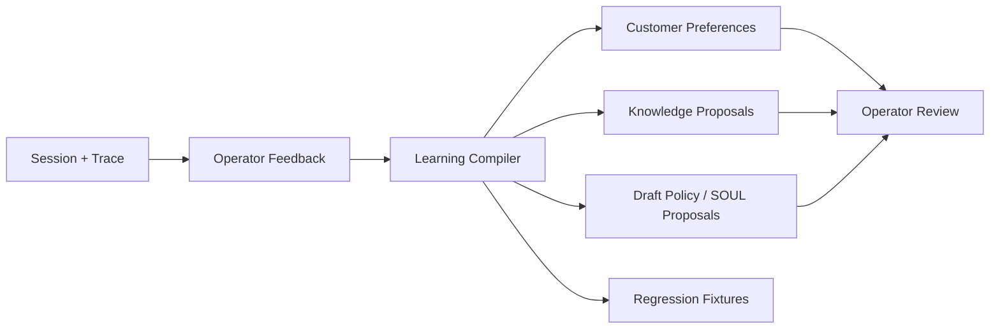
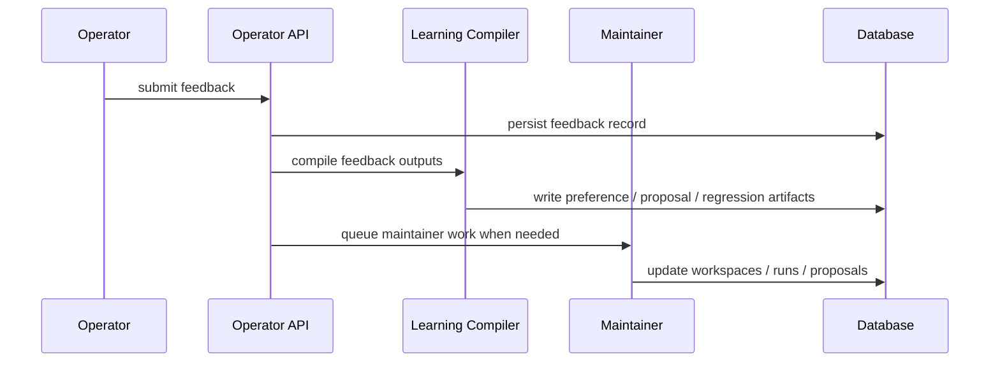

# Feedback Loop / Learning

Parmesan has a closed-loop learning system, but live customer sessions do not
directly mutate active production behavior.

## What This Page Covers

Use this page when you need to understand:

- what feedback can be captured today
- what artifacts learning can produce
- what remains governed versus automatic
- how the maintainer path relates to customer turns

## Inputs

Think of learning inputs as signals, not automatic production edits.

The main learning inputs are:

- session-level operator feedback
- response-scoped feedback
- customer preference signals
- seeded and synced knowledge sources
- learning from conversation history

These inputs are intentionally broader than just one “thumbs up / thumbs down”
feedback box.

## What Feedback Can Produce

Feedback can compile into:

- customer preferences
- shared knowledge proposals
- customer memory
- draft policy / SOUL proposals
- regression fixture candidates

Not every feedback item produces every artifact. The compiler decides what is
actionable and what scope it belongs to.

## Learning Boundaries

Parmesan keeps these boundaries explicit:

- retrieval is not learning
- runtime turns do not mutate active policy
- customer preferences do not override hard safety or business rules
- shared knowledge changes remain reviewable
- policy changes become proposals first

These boundaries are the point of the system. Parmesan is trying to be
improvable without becoming opaque or self-mutating.

## Knowledge Loop

The current system supports:

- file-backed seeded knowledge
- typed compiled knowledge snapshots
- operator-visible knowledge sources, jobs, pages, proposals, and lint
- maintainer jobs that update knowledge workspaces and proposals

The long-range direction is documented in the repository discussions around a
more LLM-maintained evolving wiki, but the current implementation is still a
governed typed-knowledge system with proposal and apply steps.

So the current model is best understood as:

- LLM-assisted and maintainer-driven
- proposal-oriented
- operator-reviewable

not as a fully autonomous self-editing wiki runtime.

## Preference Loop

Customer-specific learning flows into preference records with lifecycle actions:

- confirm
- reject
- expire

This keeps customer memory explicit and reviewable.

Customer preference learning is intentionally narrower than policy change. A
preference can personalize behavior inside allowed boundaries; it does not
override hard rules.

## Post-Turn Learning Lifecycle

Learning is a real post-turn runtime path, not just a conceptual future hook.

The current lifecycle is:

1. a customer turn finishes
2. Parmesan evaluates explicit conversation signals and feedback signals
3. the learning compiler produces durable artifacts such as preferences or
   proposals
4. those artifacts are stored and become operator-visible
5. later turns may consume prompt-safe preference fields where allowed

This is important operationally:

- learning happens after the turn, not inline during main response composition
- learned artifacts are durable records, not ephemeral prompt memory
- policy still governs what the runtime may do with those artifacts later

## Customer Memory Normalization

The current system deterministically extracts explicit low-risk customer memory
after a turn. Memory has categories for preferences, facts, temporary state, and
summaries. Existing customer preference APIs remain as a compatibility view over
preference memory, and preference writes are projected back into customer memory
so both surfaces stay consistent.

Examples include:

- `preferred_name`
- `contact_channel`
- `preferred_language`
- prompt-safe facts such as `location`

These are treated as customer memory artifacts, not policy mutations.

That means:

- `Call me Rina` can produce a durable `preferred_name`
- `Email me updates` can produce a durable `contact_channel`
- `I live in Jakarta` can produce a prompt-safe customer fact
- `Email me updates this week` can produce temporary memory with an expiration

Active, non-expired, prompt-safe memory is available for future turns subject to
policy boundaries. Repeated matching values refresh lineage and `last_seen_at`;
new explicit values supersede older active values for the same canonical key.
Inferred or conflicting values remain pending. Sensitive facts are blocked by
default and are not prompt-injected.

When a structured model router is available and deterministic rules do not find
a clear signal, the learner can ask for structured normalization suggestions.
Those suggestions are schema-checked, treated as reviewable/inferred memory, and
still follow the same sensitivity and prompt-safety gates.

## What Learning Does Not Do

The learning path does not:

- silently rewrite active policy
- override hard business or safety rules
- turn every conversational hint into active durable memory
- store sensitive facts by default
- bypass operator review for shared knowledge or policy proposals

This keeps the system improvable without making runtime behavior opaque.

## Operator Role

Operators remain central to learning:

- they submit feedback
- they review proposals
- they confirm preferences
- they inspect teaching state
- they can export regression candidates

Operators are not bypassed here. They are part of the learning loop by design.

## Dashboard Surfaces

Relevant current operator surfaces include:

- session feedback
- teaching-state inspection
- control-state and recent change views
- regression and quality-related operator endpoints

The backend supports richer response-scoped feedback than the current dashboard
fully exposes, so the learning backend is ahead of the operator UX in some
areas.

## Implementation References

- feedback ingest and lineage endpoints: `internal/api/http/server.go`
- feedback domain model: `internal/domain/feedback/types.go`
- learning compiler: `internal/knowledge/learning/learning.go`
- maintainer runner: `internal/maintainer/runner.go`
- retriever and compiled knowledge: `internal/knowledge/retriever/` and `internal/knowledge/compiler/`
- customer preference lifecycle: `internal/api/http/server.go`
