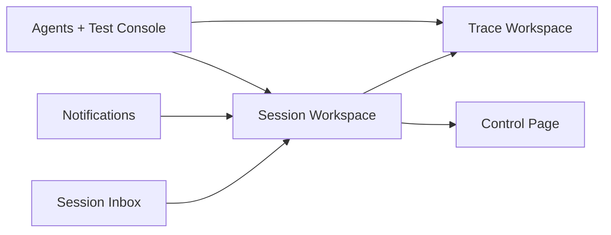
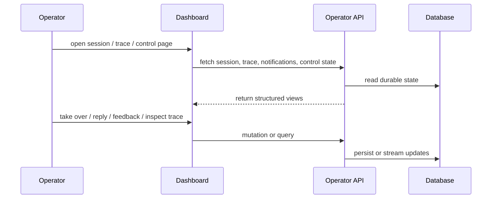

# Operations / Dashboard

The dashboard is the main operator control panel for supervising customer-facing
agents.

## What This Page Covers

Use this guide when you need to:

- understand the operator-facing surfaces
- orient a new operator quickly
- map dashboard pages to backend capabilities
- see where the current UX is strong and where it is still thin

## Visual Walkthrough

The dashboard is easier to understand with the two operator entry screens in
mind:

### Token Gate

Operators enter the bearer token configured for the dashboard/API before any
session or policy data is shown.

### Session Inbox

After sign-in, the session inbox is the main operational landing page. It
combines queue metrics, filters, and the live session list in one surface.

## Main Areas

| Area | What operators do there |
| --- | --- |
| Sessions | monitor queue state and open live session workspaces |
| Session workspace | inspect transcript, intervene, reply, add notes, and submit session feedback |
| Trace workspace | inspect a structured causal timeline for a specific execution trace |
| Notifications | watch approvals, failures, moderation alerts, and live attention items |
| Agents | inspect profiles and jump into the test console |
| Test console | create isolated ACP sessions and inspect runtime behavior |
| Control | inspect composed policy, knowledge, and governance state |

### Sessions

The session inbox is the operational entry point. Operators can:

- list and filter sessions
- inspect active/problem sessions
- open session detail

### Session Workspace

The session workspace supports:

- transcript inspection
- operator takeover / resume
- operator-visible and on-behalf replies
- notes
- session-level feedback submission
- recovery actions for executions
- lifecycle and teaching-state inspection

### Trace Workspace

The dedicated trace workspace supports:

- neighboring trace navigation for a session
- structured causal timeline
- selected-entry inspection
- live updates while the session stream is active

### Notifications

The notifications surface supports:

- live operator feed
- filtering
- moderation alerts
- browser desktop notifications while the dashboard is open

### Agents

Operators can:

- list agents
- inspect agent configuration and control state
- open the agent test console

### Agent Test Console

The test console supports:

- isolated ACP session creation
- session metadata and `_meta` injection
- scenario presets
- live event stream inspection
- links into the session and trace workspaces

### Control

The control page is the read-oriented governance surface for:

- composed policy state
- capability isolation
- knowledge state
- teaching state
- recent control changes and lineage

## Current Operational Strengths

The dashboard is currently strong at:

- session inspection
- operator intervention
- trace debugging
- notification monitoring
- agent testing
- policy/control inspection

The screenshots above reflect the current dashboard implementation in
`dashboard/src/` and are intended to orient operators. The exact data shown in
the UI will vary by deployment.

## Current Remaining Gaps

The biggest remaining operator gaps are:

- dedicated approval inbox and direct resolution flow
- richer per-response feedback UI, even though response-scoped feedback already
  exists in the backend
- stronger learning outcome visibility
- richer notification management such as ack/snooze/unread

## Related Contract

For the ACP and operator API contract details, see:

- [ACP v1](./acp/README.md)

## Implementation References

- dashboard shell and routes: `dashboard/src/App.tsx`
- session inbox: `dashboard/src/pages/SessionsPage.tsx`
- session workspace: `dashboard/src/pages/SessionDetailPage.tsx`
- trace workspace: `dashboard/src/pages/TraceWorkspacePage.tsx`
- notifications: `dashboard/src/pages/NotificationsPage.tsx`
- agent test console: `dashboard/src/pages/AgentTestPage.tsx`
- control page: `dashboard/src/pages/ControlPage.tsx`
- operator API handlers: `internal/api/http/server.go`
